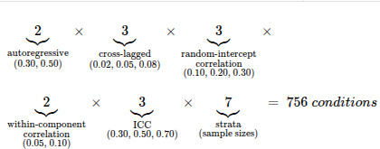
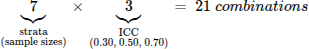

Power and Minimum Detectable Effect Analysis: RI-CLPM
================
Memory and Depressive Symptoms Working Group
<br>September 24, 2026

<style type="text/css">
body {
  font-family: "Times New Roman", Times, serif;
  font-size: 12pt;
  font-weight: normal;
}
</style>

## 1. Libraries

``` r
# install.packages("powRICLPM")
# install.packages(c("future", "progressr"))

library(powRICLPM)
library(future)
library(progressr)
library(dplyr)
library(gt)
library(tidyr)
library(ggplot2)
```

## 2. Input values

Input values for the power and minimum detectable effect (MDE) analysis
were extracted from 30 articles that longitudinally explored the
bidirectional relation between memory and depressive symptoms in
community-dwelling adults aged 45 years or over. These values,
representing standardized, within-person, cross-lagged effects were
0.02, 0.05, and 0.08. The random-intercept correlations (0.10, 0.20,
0.30) and within-component correlations (0.05, 0.10) were drawn from 2
of the 30 articles (Best & Cosco, 2022; Csajbók et al., 2023).
Autoregressive effects (0.30, 0.50) and the intraclass correlation
coefficient (ICC) (0.30, 0.50, 0.70) were set to conventional benchmarks
(Mulder, 2022), with the ICC spanning a wide range given its strong
influence on random intercept - cross-lagged panel model (RI-CLPM)
power.

The stratum sizes for the analysis were based on the number of
participants in the CLSA’s Tracking and Comprehensive Cohorts who
provided data at all three timepoints:

- Culture
  - Non-white: n = 1,466
  - White: n = 40,432
- Birthplace
  - Outside Canada: n = 6,871
  - In Canada: n = 35,585
- Language mainly spoken in the home
  - Language other than English: 8,714
  - English: 33,524
- Total sample: n = 42,462[^1]

``` r
# --- Focal within-person lagged effects (standardized) ---------------------
ar_values <- c(0.30, 0.50)         # autoregressive  -> Phi diagonal
cl_values <- c(0.02, 0.05, 0.08)   # cross-lagged     -> Phi off-diagonal

# One Phi per AR x CL combination.
# Rows = outcomes, cols = predictors; A = depressive symptoms, B = memory.
# Cross-lags entered with equal magnitude in both directions.
Phi_grid <- list()
for (ar in ar_values) for (cl in cl_values) {
  Phi_grid[[sprintf("ar%.2f_cl%.2f", ar, cl)]] <-
    matrix(c(ar, cl,
             cl, ar), nrow = 2, byrow = TRUE)
}

# --- Second-order axes, gridded externally (not native powRICLPM conditions) ---
RIcor_grid <- c(0.10, 0.20, 0.30)  # random-intercept correlation
wcor_grid  <- c(0.05, 0.10)        # within-component residual correlation

# --- Native powRICLPM condition axes (crossed inside each call) --------------
ICC_grid <- c(0.30, 0.50, 0.70)    # proportion of between-person variance
cell_Ns  <- c(1466, 6871, 8714, 33524, 35585, 40432, 42462)  # stratum sizes

# Verify powRICLPM reads Phi as intended (prints a textual interpretation)
check_Phi(Phi_grid[["ar0.30_cl0.05"]])
```

## 3. Power analysis

Power was estimated by Monte Carlo simulation across a series of
conditions, with each condition denoting a unique combination of the
following items: sample size (the seven strata); the proportion of
between-person variance (ICC = 0.30, 0.50, 0.70); the autoregressive and
cross-lagged effects; the random-intercept correlation; and the
within-component correlation. The number of repeated measures was fixed
at 3 to reflect the number of waves of available CLSA data.

<figure>

<figcaption aria-hidden="true">EQ1</figcaption>
</figure>

For each of the 756 conditions, 1,000 datasets (reps = 1,000) were
generated from the input values using the data simulation procedure in
R’s
<span style="font-family: 'Courier New'; font-size: 12pt;">lavaan</span>
package (Rosseel, 2012). We scaled the residualized, person-centred
parts of each construct (memory and depressive symptoms) to unit
variance so that the lagged effects were interpretable as standardized
effects. With 756 conditions and 1,000 replications per condition, we
fitted 756,000 models using the software.

The
<span style="font-family: 'Courier New'; font-size: 12pt;">powRICLPM</span>
package (Mulder, 2022) evaluated three inputs (number of participants,
proportion of between-person variance, and number of waves)
simultaneously. The other three inputs (autoregressive effects,
cross-lagged effects, and two correlations) had to be supplied one set
at a time, requiring 36 separate runs of the package. Each run evaluated
21 combinations of sample size and ICC, so that the 36 runs together
covered all 756 conditions. Elapsed time to complete the 36 runs was
10:50:59 (hh:mm:ss).

<figure>

<figcaption aria-hidden="true">EQ2</figcaption>
</figure>

We fitted each of the 1,000 replications per condition with the RI-CLPM
by maximum likelihood. Power for a given parameter[^2] was computed as
the proportion of converged replications in which that parameter was
statistically significant by the normal-theory Wald (z) test at α = .05;
non-converged solutions were discarded, and convergence rates were
monitored across all conditions (mean convergence rate = 96.3%; minimum
convergence rate = 87.8%). Because power was a simulated proportion, it
carried Monte Carlo error: at 1,000 replications, the standard error of
a power estimate near 0.80 was approximately 0.013 (about ±.03), and
this uncertainty is reflected in the
<span style="font-family: 'Courier New'; font-size: 12pt;">powRICLPM</span>
package’s output.

``` r
reps <- 1000
seed <- 20240722

# External grid: Phi (6) x RI_cor (3) x within_cor (2) = 36 powRICLPM calls;
# each call internally crosses the 7 cell sizes x 3 ICC values.
grid_ext <- expand.grid(
  Phi_label  = names(Phi_grid),
  RI_cor     = RIcor_grid,
  within_cor = wcor_grid,
  stringsAsFactors = FALSE
)

fits <- vector("list", nrow(grid_ext))

with_progress({
  for (i in seq_len(nrow(grid_ext))) {
    fits[[i]] <- list(
      meta = grid_ext[i, ],
      out  = powRICLPM(
        target_power = 0.80,
        sample_size  = cell_Ns,
        time_points  = 3,
        ICC          = ICC_grid,
        RI_cor       = grid_ext$RI_cor[i],
        Phi          = Phi_grid[[ grid_ext$Phi_label[i] ]],
        within_cor   = grid_ext$within_cor[i],
        reliability  = 1,
        reps         = reps,
        seed         = seed
      )
    )
    saveRDS(fits, "powRICLPM_fits.rds")
  }
})
```

## 4. Extract power and convergence

``` r
reps_used <- 1000

# Pull results for one parameter from one fit, attach convergence info
# and the external-grid metadata (Phi, RI_cor, within_cor).
pull_param <- function(fit, param) {
  res  <- give(fit$out, "results", parameter = param)
  prob <- give(fit$out, "estimation_problems")

  res |>
    left_join(prob, by = c("sample_size", "time_points", "ICC", "reliability")) |>
    mutate(
      parameter   = param,
      Phi_label   = fit$meta$Phi_label,
      AR          = as.numeric(sub("ar([0-9.]+)_cl.*", "\\1", fit$meta$Phi_label)),
      CL          = as.numeric(sub(".*_cl([0-9.]+)", "\\1", fit$meta$Phi_label)),
      RI_cor      = fit$meta$RI_cor,
      within_cor  = fit$meta$within_cor,
      n_converged = reps_used - errors - not_converged - inadmissible,
      convergence = n_converged / reps_used
    )
}

# Bind across all 36 external grid combinations, for both focal cross-lags
power_grid <- bind_rows(
  lapply(fits, pull_param, param = "wB2~wA1"),   # depressive symptoms -> memory
  lapply(fits, pull_param, param = "wA2~wB1")    # memory -> depressive symptoms
)

# --- Checks ---------------------------------------------------------------
#   full run   (7 cells):  36 x 21 x 2 = 1512
dim(power_grid)

# Convergence figures for the methods paragraph
data.frame(
  min_convergence  = min(power_grid$convergence,  na.rm = TRUE),
  mean_convergence = mean(power_grid$convergence, na.rm = TRUE)
)

# Compact view of the two focal cross-lagged effects
power_grid |>
  select(parameter, CL, AR, RI_cor, within_cor,
         sample_size, ICC, power, convergence) |>
  arrange(parameter, CL, sample_size, ICC)
```

## 5. Minimum detectable effects

The minimum detectable effects (MDEs)[^3] at 80% power were derived for
each stratum size and ICC from the empirical standard errors (empSE)
returned by the
<span style="font-family: 'Courier New'; font-size: 12pt;">powRICLPM</span>
package’s power estimates. The empSE is the standard deviation of a
parameter across the converged replications within a condition. The
empSE serves as the simulated sampling variability of that parameter.

Since the standard error of a cross-lagged path is invariant to the
magnitude of that path, and the Wald statistic is asymptotically normal,
the MDE at a given power is
$\text{MDE} = (z_{1-\alpha/2} + z_{\text{power}}) \times SE$. For α =
0.05 and power = 0.80, $z$ denotes the standard normal quantile
function: $z_{(1 − α/2)} = 1.960$ and $z_{\text{power}} = 0.842$. MDEs
are reported for the depressive symptoms → memory path; the reverse path
yielded equivalent results.

``` r
# Convergence
power_grid |>
  summarise(min_convergence  = min(convergence,  na.rm = TRUE),
            mean_convergence = mean(convergence, na.rm = TRUE),
            n_below_95       = sum(convergence < 0.95, na.rm = TRUE))

# Relevance of nuisance parameters
power_grid |>
  group_by(parameter, CL, AR, sample_size, ICC) |>
  summarise(power_min = min(power), power_max = max(power),
            spread = max(power) - min(power), .groups = "drop") |>
  summarise(max_spread_across_nuisance = max(spread))

# Result
mde <- power_grid |>
  filter(parameter == "wB2~wA1") |>
  group_by(sample_size, ICC) |>
  summarise(SE = mean(EmpSE), .groups = "drop") |>
  mutate(MDE = (qnorm(0.975) + qnorm(0.80)) * SE)

mde.table <- as.data.frame(tidyr::pivot_wider(mde |> select(-SE),
                                 names_from = ICC, values_from = MDE))

# Result as formatted table
mde.table |>
  gt(rowname_col = "sample_size") |>
  tab_header(
    title = "Minimum detectable, standardized, within-person, cross-lagged regression coefficients (RI-CLPM), controlling for autoregressive effects, at 80% power and α = .05, across three waves of data."
  ) |>
  tab_spanner(
    label = "ICC",
    columns = c(`0.3`, `0.5`, `0.7`)
  ) |>
  cols_label(
    `0.3` = ".30",
    `0.5` = ".50",
    `0.7` = ".70"
  ) |>
  tab_stubhead(label = "Stratum size (n)") |>
  fmt_number(columns = c(`0.3`, `0.5`, `0.7`), decimals = 3) |>
  fmt_number(columns = "sample_size", decimals = 0, use_seps = TRUE) |>
  cols_align(align = "center", columns = c(`0.3`, `0.5`, `0.7`)) |>
   tab_footnote(
    footnote = "ICC (intraclass correlation coefficient) = proportion of between-person variance.",
    locations = cells_column_spanners(spanners = "ICC")
  ) |>
  tab_options(
    table.font.size = px(13),
    heading.title.font.size = px(13),
    heading.align = "left"
  )

# Result as a graph
mde_long <- mde.table |>
  pivot_longer(cols = -sample_size, names_to = "ICC", values_to = "MDE") |>
  mutate(
    # Categorical, equidistant, ordered by cell size
    stratum = factor(format(sample_size, big.mark = ",", trim = TRUE),
                     levels = format(sort(unique(sample_size)),
                                     big.mark = ",", trim = TRUE)),
    ICC = factor(ICC, levels = c("0.3", "0.5", "0.7"),
                 labels = c(".30", ".50", ".70"))
  )

ggplot(mde_long, aes(x = stratum, y = MDE, colour = ICC, group = ICC)) +
  geom_line(linewidth = 0.8) +
  geom_point(size = 2.5) +
  scale_y_continuous(limits = c(0, NA), breaks = seq(0, 0.20, 0.02)) +
  labs(
    x = "Stratum size (n)",
    y = "Minimum detectable coefficient",
    colour = "ICC",
    title = "Minimum detectable within-person cross-lagged coefficients (RI-CLPM)",
    subtitle = "Standardized regression coefficients detectable at 80% power, α = .05, three waves"
  ) +
  theme_minimal(base_size = 12) +
  theme(
    axis.text.x = element_text(angle = 45, hjust = 1),
    panel.grid.minor = element_blank(),
    legend.position = "right"
  )
```

## 5. Results

We found 80% power to detect MDEs as small as 0.022 in the total sample
(n = 42,462) when ICC = 0.30, and 0.033 when ICC = 0.70. The three
largest strata performed comparably: coefficients of 0.022 to 0.036 were
detectable among White participants (n = 40,432), those born in Canada
(n = 35,585), and those speaking English at home (n = 33,524). Among
participants who spoke a language other than English at home (n =
8,714), the minimum detectable coefficients at 80% power were 0.048 to
0.072; they were 0.048 to 0.081 for those born outside Canada (n =
6,871). A regression coefficient of 0.08 could be detected with 87% to
99% power in the ‘language other than English at home’ stratum, and 79%
to 98% power in the ‘born outside Canada’ stratum, depending on ICC. The
smallest stratum, participants identifying as non-White (n = 1,466), had
80% power to detect MDEs of 0.118 or above, also depending on ICC.

**Conclusion:** Based on Orth et al.’s (2024) benchmarks, we can detect
small or medium effects within all strata except ‘non-white’, for which
we can detect large effects.

## 6. References

<div id="refs" class="references csl-bib-body hanging-indent">

<div id="ref-abella2025relationship" class="csl-entry">

Abella, Mireia, Adrián García-Mollá, Aitana Sanz, José M. Tomás, and
Marta Aliño. 2025. “Relationship Between Immediate Memory, Depressive
Symptomatology and Loneliness in Older Adults: A Longitudinal Study.”
*Aging & Mental Health* 29 (7): 1266–73.
<https://doi.org/10.1080/13607863.2025.2478502>.

</div>

<div id="ref-aichele2019memory" class="csl-entry">

Aichele, Stephen, and Paolo Ghisletta. 2019. “Memory Deficits Precede
Increases in Depressive Symptoms in Later Adulthood.” *The Journals of
Gerontology, Series B: Psychological Sciences and Social Sciences* 74
(6): 943–53. <https://doi.org/10.1093/geronb/gbx183>.

</div>

<div id="ref-best2022analysis" class="csl-entry">

Best, John R., and Theodore D. Cosco. 2022. “An Analysis of Dynamic,
Bidirectional Associations Between Memory and Verbal Fluency with
Depressive Symptoms in Middle- and Older-Aged Adults: A Cohort Study.”
*Journal of Affective Disorders* 318: 400–408.
<https://doi.org/10.1016/j.jad.2022.09.019>.

</div>

<div id="ref-bunce2014causal" class="csl-entry">

Bunce, David, Philip J. Batterham, Helen Christensen, and Andrew J.
Mackinnon. 2014. “Causal Associations Between Depression Symptoms and
Cognition in a Community-Based Cohort of Older Adults.” *The American
Journal of Geriatric Psychiatry* 22 (12): 1583–91.
<https://doi.org/10.1016/j.jagp.2014.01.004>.

</div>

<div id="ref-chen2026longterm" class="csl-entry">

Chen, Cheng-Chuan, Na Zhou, Xiao-Wen Wu, Yun Qiao, and Xiao-Bin Wang.
2026. “Long-Term Patterns of Depressive Symptoms and Cognitive Aging in
Middle-Aged and Older Adults.” *Archives of Public Health*, ahead of
print. <https://doi.org/10.1186/s13690-026-01966-4>.

</div>

<div id="ref-cheng2025cognitive" class="csl-entry">

Cheng, Sijie, Qi Wang, Xuebin Qiao, and Aijun Xu. 2025. “Cognitive
Decline and Depression Risk in Middle-Aged and Older Adults:
Longitudinal Intermediary Roles of Executive Functions and Episodic
Memory.” *Acta Psychologica* 261: 106013.
<https://doi.org/10.1016/j.actpsy.2025.106013>.

</div>

<div id="ref-csajbok2023between" class="csl-entry">

Csajbók, Zsofia, Dag Aarsland, and Pavla Cermakova. 2023.
“Between-Person and Within-Person Effects in the Temporal Relationship
Between Depressive Symptoms and Cognitive Function.” *Journal of
Affective Disorders* 331: 380–85.
<https://doi.org/10.1016/j.jad.2023.03.057>.

</div>

<div id="ref-desai2020temporal" class="csl-entry">

Desai, Roopal, Georgina M. Charlesworth, Helen J. Brooker, et al. 2020.
“Temporal Relationship Between Depressive Symptoms and Cognition in Mid
and Late Life: A Longitudinal Cohort Study.” *Journal of the American
Medical Directors Association* 21 (8): 1108–13.
<https://doi.org/10.1016/j.jamda.2020.01.106>.

</div>

<div id="ref-hopper2024bidirectional" class="csl-entry">

Hopper, Shawna, Alexandra Grady, John R. Best, and Arne Stinchcombe.
2024. “Bidirectional Associations Between Memory and Depression
Moderated by Sex and Age: Findings from the CLSA.” *Archives of
Gerontology and Geriatrics* 116: 105154.
<https://doi.org/10.1016/j.archger.2023.105154>.

</div>

<div id="ref-jain2024together" class="csl-entry">

Jain, Urvashi, and Mingming Ma. 2024. “Together in Sickness and in
Health: Spillover of Physical, Mental, and Cognitive Health Among Older
English Couples.” *Health Economics* 33 (9): 1989–2012.
<https://doi.org/10.1002/hec.4860>.

</div>

<div id="ref-jajodia2011memory" class="csl-entry">

Jajodia, A., and A. Borders. 2011. “Memory Predicts Changes in
Depressive Symptoms in Older Adults: A Bidirectional Longitudinal
Analysis.” *The Journals of Gerontology, Series B: Psychological
Sciences and Social Sciences* 66 (5): 571–81.
<https://doi.org/10.1093/geronb/gbr035>.

</div>

<div id="ref-jindra2022depression" class="csl-entry">

Jindra, Christoph, Chenlu Li, Ruby S. M. Tsang, Sarah Bauermeister, and
John Gallacher. 2022. “Depression and Memory Function – Evidence from
Cross-Lagged Panel Models with Unit Fixed Effects in ELSA and HRS.”
*Psychological Medicine* 52 (8): 1428–36.
<https://doi.org/10.1017/S0033291720003037>.

</div>

<div id="ref-jones2019depressive" class="csl-entry">

Jones, Jacob D., Natalie E. Kurniadi, Taylor P. Kuhn, Sarah M.
Szymkowicz, Joseph Bunch, and Elizabeth Rahmani. 2019. “Depressive
Symptoms Precede Cognitive Impairment in de Novo Parkinson’s Disease
Patients: Analysis of the PPMI Cohort.” *Neuropsychology* 33 (8):
1111–20. <https://doi.org/10.1037/neu0000583>.

</div>

<div id="ref-li2025relationship" class="csl-entry">

Li, Shuaichen, Jinglan Tan, Yanwei Guo, et al. 2025. “The Relationship
Between Cognitive Function and Depressive Symptoms in Chinese Older
Adults: A Cross-Lagged Panel Network Analysis.” *General Hospital
Psychiatry* 97: 203–8.
<https://doi.org/10.1016/j.genhosppsych.2025.10.016>.

</div>

<div id="ref-li2023dyadic" class="csl-entry">

Li, Yujin, Qi Wu, Lizhi Guo, Nethmi Sulakna Weerawardena, Fengping Luo,
and Bin Yu. 2023. “Dyadic Effects of Cognitive Function on Depressive
Symptoms Among Middle-Aged and Older Chinese Couples.” *International
Journal of Geriatric Psychiatry* 38 (4): e5909.
<https://doi.org/10.1002/gps.5909>.

</div>

<div id="ref-ma2026dynamic" class="csl-entry">

Ma, Hongfei, Feiran Wei, Meng Zhao, and Xiaobing Shen. 2026. “Dynamic
Interplay Between Depressive Symptoms and Cognitive Function in Chinese
Middle-Aged and Older Adults: A Cross-Lagged Panel Network Analysis
Before and After Cancer Diagnosis.” *Supportive Care in Cancer* 34 (7):
714. <https://doi.org/10.1007/s00520-026-10939-w>.

</div>

<div id="ref-ma2025longitudinal" class="csl-entry">

Ma, Hongfei, Meng Zhao, Huimin Yin, Shuang Zhao, and Pingmin Wei. 2025.
“Longitudinal Associations Between Depression Symptoms and Cognitive
Functions in Chinese Older Adults: A Cross-Lagged Panel Network
Analysis.” *Depression and Anxiety* 2025: 3984020.
<https://doi.org/10.1155/da/3984020>.

</div>

<div id="ref-ma2025bidirectional" class="csl-entry">

Ma, Xu, Xingyu Zhou, and Yuran Qiu. 2025. “Bidirectional Relationships
Between Cognitive Decline and Depression: A Study of Middle-Aged and
Older Adults Using Cross-Lagged Panel Network Analysis.” *Journal of
Affective Disorders* 389: 119741.
<https://doi.org/10.1016/j.jad.2025.119741>.

</div>

<div id="ref-mulder2022structural" class="csl-entry">

Mulder, Jeroen D. 2022. “Power Analysis for the Random Intercept
Cross-Lagged Panel Model Using the powRICLPM r-Package.” *Structural
Equation Modeling: A Multidisciplinary Journal* 30: 645–58.
https://doi.org/<https://doi.org/10.1080/10705511.2022.2122467>.

</div>

<div id="ref-orth2024effect" class="csl-entry">

Orth, Ulrich, Laurenz L. Meier, Janina Larissa Bühler, et al. 2024.
“Effect Size Guidelines for Cross-Lagged Effects.” *Psychological
Methods* 29 (2): 421–33. <https://doi.org/10.1037/met0000499>.

</div>

<div id="ref-panza2009temporal" class="csl-entry">

Panza, Francesco, Alessia D’Introno, Anna M. Colacicco, et al. 2009.
“Temporal Relationship Between Depressive Symptoms and Cognitive
Impairment: The Italian Longitudinal Study on Aging.” *Journal of
Alzheimer’s Disease* 17 (4): 899–911.
<https://doi.org/10.3233/JAD-2009-1111>.

</div>

<div id="ref-peng2025episodic" class="csl-entry">

Peng, Manman, and Pengfei Wang. 2025. “Episodic Memory, Depressive
Symptoms, and Functional Disability in Middle-Aged and Older Chinese
Adults: The Moderating Role of Social Participation Trajectory.” *Asia
Pacific Journal of Social Work and Development*, ahead of print.
<https://doi.org/10.1080/29949769.2025.2587652>.

</div>

<div id="ref-petkus2020exposure" class="csl-entry">

Petkus, Andrew J., Diana Younan, Keith Widaman, et al. 2020. “Exposure
to Fine Particulate Matter and Temporal Dynamics of Episodic Memory and
Depressive Symptoms in Older Women.” *Environment International* 135:
105196. <https://doi.org/10.1016/j.envint.2019.105196>.

</div>

<div id="ref-rosseel2012" class="csl-entry">

Rosseel, Yves. 2012. “<span class="nocase">lavaan</span>: An R Package
for Structural Equation Modeling.” *Journal of Statistical Software* 48
(2): 1–36. <https://doi.org/10.18637/jss.v048.i02>.

</div>

<div id="ref-sun2024depressive" class="csl-entry">

Sun, He-Li, Pan Chen, Wei Bai, et al. 2024. “Depressive Symptoms and
Cognitive Function in Older Adults: A Cross-Lagged Network Analysis.”
*Depression and Anxiety* 2024: 6166775.
<https://doi.org/10.1155/2024/6166775>.

</div>

<div id="ref-teles2021depressive" class="csl-entry">

Teles, Mariana, and Dingjing Shi. 2021. “Depressive Symptoms as a
Predictor of Memory Decline in Older Adults: A Longitudinal Study Using
the Dual Change Score Model.” *Archives of Gerontology and Geriatrics*
97: 104501. <https://doi.org/10.1016/j.archger.2021.104501>.

</div>

<div id="ref-wu2021longitudinal" class="csl-entry">

Wu, Zhangying, Xiaomei Zhong, Qi Peng, et al. 2021. “Longitudinal
Association Between Cognition and Depression in Patients with Late-Life
Depression: A Cross-Lagged Design Study.” *Frontiers in Psychiatry* 12:
577058. <https://doi.org/10.3389/fpsyt.2021.577058>.

</div>

<div id="ref-yin2024bidirectional" class="csl-entry">

Yin, Jiamin, Amber John, and Dorina Cadar. 2024. “Bidirectional
Associations of Depressive Symptoms and Cognitive Function over Time.”
*JAMA Network Open* 7 (6): e2416305.
<https://doi.org/10.1001/jamanetworkopen.2024.16305>.

</div>

<div id="ref-yu2018directional" class="csl-entry">

Yu, Junhong, Hui-Ying Lim, Fadzillah Nur d/o Mohd Abdullah, et al. 2018.
“Directional Associations Between Memory Impairment and Depressive
Symptoms: Data from a Longitudinal Sample and Meta-Analysis.”
*Psychological Medicine* 48 (10): 1664–72.
<https://doi.org/10.1017/S0033291717003154>.

</div>

<div id="ref-yuan2023temporal" class="csl-entry">

Yuan, Jing, Yan Wang, and Zejun Liu. 2023. “Temporal Relationship
Between Depression and Cognitive Decline in the Elderly: A Two-Wave
Cross-Lagged Study in a Chinese Sample.” *Aging & Mental Health* 27
(11): 2179–86. <https://doi.org/10.1080/13607863.2023.2225432>.

</div>

<div id="ref-zainal2023crosslagged" class="csl-entry">

Zainal, Nur Hani, and Michelle G. Newman. 2023a. “A Cross-Lagged
Prospective Network Analysis of Depression and Anxiety and Cognitive
Functioning Components in Midlife Community Adult Women.” *Psychological
Medicine* 53 (9): 4160–71. <https://doi.org/10.1017/S0033291722000848>.

</div>

<div id="ref-zainal2023elevated" class="csl-entry">

Zainal, Nur Hani, and Michelle G. Newman. 2023b. “Elevated Anxious and
Depressed Mood Relates to Future Executive Dysfunction in Older Adults:
A Longitudinal Network Analysis of Psychopathology and Cognitive
Functioning.” *Clinical Psychological Science* 11 (2): 218–38.
<https://doi.org/10.1177/21677026221114076>.

</div>

<div id="ref-zhang2025longitudinal" class="csl-entry">

Zhang, Daiyan, and Maria Semkovska. 2025. “Longitudinal Changes in the
Extended Networks of Depressive Symptoms and Cognitive Functions
Following Bereavement: Comparison Between Progressively Depressed and
Continuously Non-Depressed Older Adults.” *Age and Ageing* 54 (9):
afaf278. <https://doi.org/10.1093/ageing/afaf278>.

</div>

</div>

[^1]: Variable-specific numbers may not total 42,462 due to missing
    data.

[^2]: Regression coefficients: the autoregressive and cross-lagged
    paths; Variances: the random-intercept variances and
    within-component residual variances; Covariances: the
    random-intercept covariance and within-wave residual covariances.

[^3]: In this case, the MDEs are standardized, within-person,
    cross-lagged regression coefficients (the minimum coefficients one
    can expect to detect at a given power).
