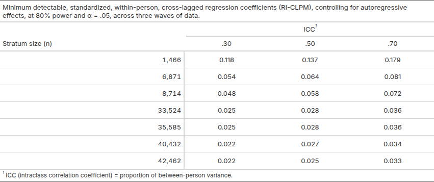

# RI-CLPM

Monte Carlo power analysis for a bivariate, random intercept, cross-lagged panel model
(RI-CLPM) of depressive symptoms and memory in the Canadian Longitudinal Study on Aging
(CLSA), across three waves of follow-up.

## Overview

This repository contains the code and outputs for a simulation-based power analysis
assessing the minimum detectable, within-person, cross-lagged effects across seven
analytic strata (total sample and subgroups defined by culture, birthplace, and language
spoken at home).

## Data availability

CLSA data **are not** included in this repository. Persons wishing to access CLSA 
data must apply for access. Visit https://www.clsa-elcv.ca/data-access/ for more information.

## Files in the repository

1. Bibliography.bib: all references shown at the end of Power_Calculations_RI-CLPM.html.
2. Power_Calculations_RI-CLPM.html: the R code used in the power analysis, along with written
methods and results, and a bibliography.
3. powRICLPM_fits.rds: cached 'powRICLPM' simulation results from all 36 runs.
4. Simulation_Log.docx: timestamps for all 36 runs.

## Results

## License

MIT for code, CC BY 4.0 for documentation

## Contact

Mark Oremus 
Email: moremus@uwaterloo.ca